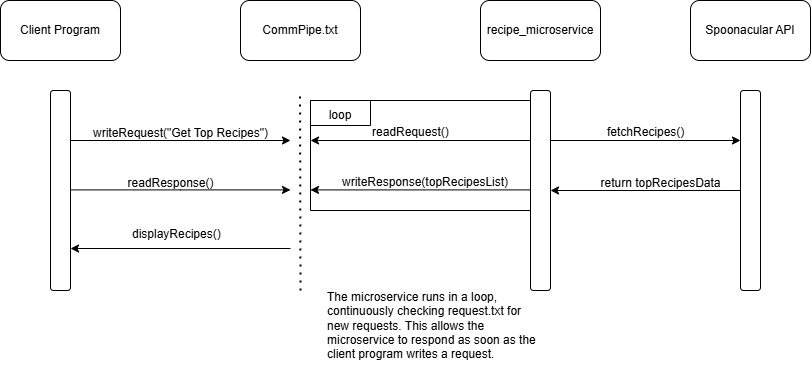

# microserviceA

Recipe Recommendation Microservice
Overview
This microservice helps you get a list of the top 10 popular recipes using the Spoonacular API. It works by reading a request from a text file, fetching recipe data from the API, and then writing back the results to another text file.

Setup
First, make sure you have Python installed on your computer. You also need to install a couple of Python packages. To do this, open your terminal and type: pip install requests python-dotenv
Next, create a file called .env in the same folder as your code. This file will store your Spoonacular API key safely. The .env file should look like: API_KEY=api_key_here
Add .env to your .gitignore file so it doesn’t get uploaded to github

How It Works
The microservice and the client program use two text files to communicate: request.txt and response.txt. The client program starts by writing "Get Top Recipes" in request.txt. The microservice reads this file, understands the request, and then uses the Spoonacular API to get the top 10 recipes.
After getting the data, the microservice writes a list of recipe names and their links to response.txt. The client program then reads the response.txt file to get the results.

Example Request and Response
If you write "Get Top Recipes" in request.txt, the microservice might write back something like this in response.txt:

1. Spaghetti Carbonara - https://www.example.com/spaghetti-carbonara
2. Chicken Tikka Masala - https://www.example.com/chicken-tikka-masala
3. Vegan Avocado Salad - https://www.example.com/vegan-avocado-salad
4. rest of recipes:

How to Run It
Open a terminal and start the microservice by typing: python recipe_microservice.py
In another terminal, run the client program: python client.py
The client program will send a request, and the microservice will respond with the top 10 recipes. You can check the response.txt file to see the list of recipes.

Troubleshooting
If something goes wrong:
Make sure the .env file has the correct API key.
Ensure that you installed the Python packages with pip install requests python-dotenv.

